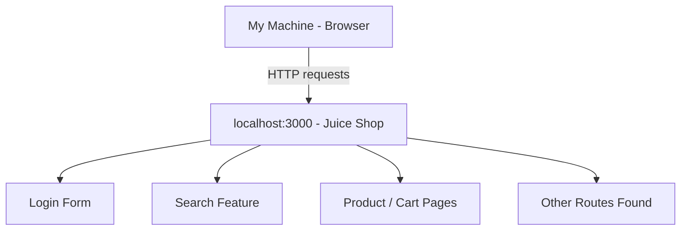

# Local Reconnaissance and Attack Surface Map

## 1. Target & Scope Confirmation

- **Target:** `http://localhost:3000` (OWASP Juice Shop)
- **Environment:** Running inside a Docker container on my own laptop only.
- **Confirmation:** This target is NOT exposed to the public internet. It only exists on `localhost` of my machine, so scanning it is authorized and legal.

---

## 2. Sanitized Command Log

```
Target: http://localhost:3000
Environment: Local isolated lab (Docker container on own machine, NOT public internet)

Commands executed:
  1) docker run -d -p 3000:3000 --name juice-shop bkimminich/juice-shop
  2) nmap -sV -p- localhost
  3) curl -I http://localhost:3000
```

**Nmap result (relevant excerpt — port 3000 is the actual target; other ports belong to the host OS, not the lab app):**
```
PORT     STATE SERVICE    VERSION
3000/tcp open  ppp?
Service Info: OS: Windows; CPE: cpe:/o:microsoft:windows
```

**HTTP headers (`curl -I http://localhost:3000`):**
```
HTTP/1.1 200 OK
Access-Control-Allow-Origin: *
X-Content-Type-Options: nosniff
X-Frame-Options: SAMEORIGIN
Feature-Policy: payment 'self'
X-Recruiting: /#/jobs
Accept-Ranges: bytes
Content-Type: text/html; charset=UTF-8
```

---

## 3. Service Inventory

> Open `nmap-scan.txt` and fill this table using what it found. Example row shown — replace with your real results.

| Port | Service | Version | Notes |
|------|---------|---------|-------|
| 3000 | HTTP (Node.js / Express, reported as `ppp?`) | Not explicitly disclosed by server | This is the actual target — OWASP Juice Shop web app |
| 135 | msrpc | Microsoft Windows RPC | Standard Windows OS service, not part of the target app |
| 445 | microsoft-ds | — | Standard Windows OS service (SMB), not part of the target app |
| 137 | netbios-ns | filtered | Standard Windows OS service |
| 5040, 24830, 49664–49669 | unknown | — | Standard Windows/system background services, unrelated to the lab target |

---

## 4. Visible Inputs / Routes

> Open `http://localhost:3000` in your browser and click around. List what you see — login form, search bar, product pages, account/cart pages, any API-looking URLs, etc.

- [ ] Login form: yes/no
- [ ] Search bar: yes/no
- [ ] Registration form: yes/no
- [x] Hidden route discovered via headers: `/#/jobs` (found in the `X-Recruiting` response header — not linked anywhere visible on the page)
- [ ] Other routes noticed (browse the site and add here): ________________

---

## 5. Attack Surface Diagram

> This renders as a real diagram when viewed on GitHub, Obsidian, or most markdown viewers. Edit the boxes to match what you actually found in Section 4.



---

## 6. Risk Hypothesis Mapping

> For each thing you found, write a plausible (not proven) risk. This is a hypothesis, not an exploit — you're just reasoning about what *could* be wrong.

| Observation | Potential Risk Hypothesis |
|-------------|---------------------------|
| Login form present | Could be vulnerable to weak password policy or SQL injection if input isn't sanitized |
| `X-Recruiting: /#/jobs` header reveals a hidden route not linked in the UI | Hidden/undocumented routes are often forgotten by developers and left with weaker access control — worth investigating further |
| Search bar accepts free text | Could be vulnerable to injection if not filtered |
| `Access-Control-Allow-Origin: *` allows any origin | Overly permissive CORS could allow malicious sites to read API responses if sensitive data is exposed |
| *(add your own after browsing the site)* | |

---

## 7. Submission Checklist

- [ ] Target confirmed as isolated lab (Section 1)
- [ ] Command log included (Section 2)
- [ ] Service inventory filled (Section 3)
- [ ] Attack-surface diagram edited to match findings (Section 5)
- [ ] At least 2–3 risk hypotheses written (Section 6)
- [ ] Everything placed in one folder/repo, one link submitted
